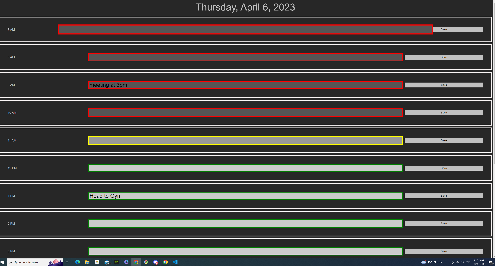

# A one day planner 

 

This code creates time blocks for a daily planner to better help organize your day. The code has an if-else function to highlight the hour of the day in either red, yellow, or green to represent the current hour. Red indicates the hour has passed, yellow for the current hour time block, and green for an hour time block yet to come. There is also a darkening feature to visibly darken the hours that have passed, making the planner easier to follow. I added a hover selector to increase the size of the text box by 20 percent to give the user easier accessibility.

The localStorage object allows you to save key-value pairs in the browser, so all entered data is saved even if the page refreshes.

Sources

University of Toronto Coding Bootcamp:

University of Toronto School of Continuing Studies. (n.d.). Coding Boot Camp. Retrieved from https://bootcamp.learn.utoronto.ca/coding/

W3Schools:

W3Schools. (n.d.). HTML, CSS, JavaScript, PHP, jQuery, and XML Tutorials. Retrieved from https://www.w3schools.com/
Stack Overflow:

Stack Overflow. (n.d.). Where Developers Learn, Share, & Build Careers. Retrieved from https://stackoverflow.com/

